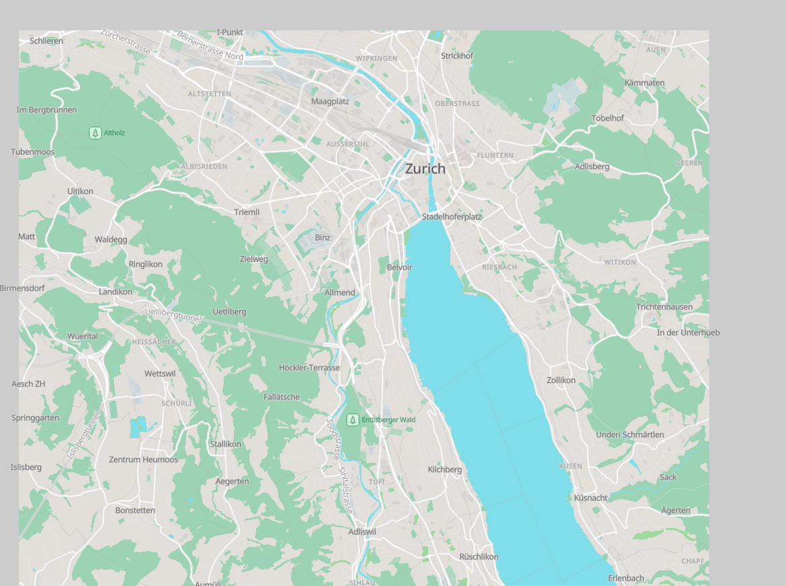

# basemap-starter
Some getting started code to show a protomaps basemap in maplibre gl js

## Steps

Clone this repo

Run a http server inside the repo folder, one that supports http range requests.

Example: `npx serve --debug . -p 3000`

Open the browser and look a the nice basemap of Zürich...

## Demo

https://wipfli.github.io/basemap-starter

## License

`zurich.pmtiles` is made with OpenStreetMap data licensed as ODbL. The rest of the code is permissive.
